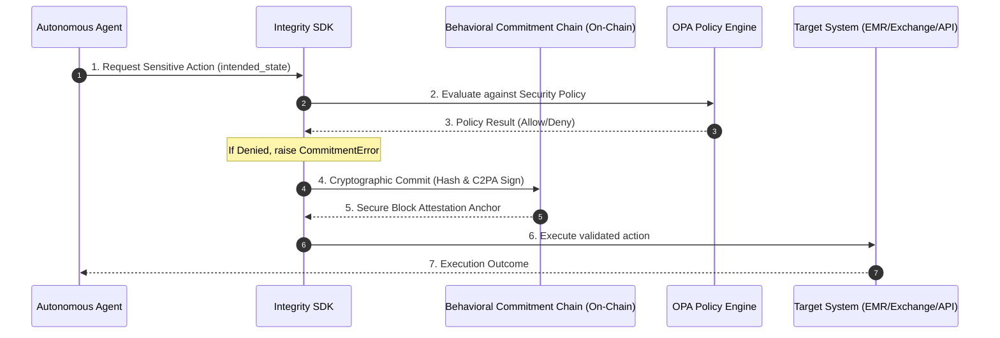

# Developing on the Integrity Protocol: 10 MVP Blueprints

Building on top of the Xibalba Integrity Protocol equips developers with standard primitives to design secure, compliant, and autonomous multi-agent applications. By anchoring off-chain LLM actions to the on-chain **Behavioral Commitment Chain (BCC)** and auditing them via **Model Contextual Integrity Protocol (MCIP)** and **Open Policy Agent (OPA)**, developers can eradicate agent hallucination risk and satisfy strict security audits.

## Core Developer Verification Flow

When building an application on the Integrity Protocol, all sensitive agentic actions follow this standardized execution lifecycle:

---

## The 10 MVP Idea Catalog

Below is a curated inventory of high-potential MVPs that developers can bootstrap today using Xibalba's cryptographic integrity stack:

| # | MVP Name | Core Domain | Primary Value Proposition |
|---|---|---|---|
| 1 | **AuditShield EMR Scribe** | Healthcare Compliance | Eliminates clinical hallucinations in ambient summaries via secure point-of-origin signing. |
| 2 | **QuantShield Isolated Daemon** | Quantitative Finance | Blocks execution hijacking during automated arbitrage runs using pre-committed locks. |
| 3 | **Decentralized Agent Credit Score** | AI Economics | Provides programmatic, reputation-based loan matching through aggregated AIS. |
| 4 | **Sovereign IoT Media Anchor** | Physical Provenance | Signs real-world sensor streams via hardware-TEE anchors to block deepfakes. |
| 5 | **ContextGuard GenUI Sandbox** | Interface Security | Defends dynamic user interfaces against prompt injections and DoubleClickjacking. |
| 6 | **ZK Claims Verifier** | InsurTech | Validates medical claims mathematically using Aztec Noir without leaking patient metadata. |
| 7 | **Ad-Fraud Agent Attestor** | AdTech | Uses hardware identity ceilings to attest that ad views originate from authentic, tethered devices. |
| 8 | **AI-Proxy DAO Guardian** | Governance | Prevents rogue AI-delegated votes by requiring pre-declared state lock-ins. |
| 9 | **Surgical Telemetry Vault** | Medical Devices | Establishes an immutable provenance record for robotic surgeries and clinical trial telemetry. |
| 10| **Insured Agent Escrow Vault** | Smart Contracts | Programmatically unlocks milestone payments based on real-time Agent Integrity Score (AIS). |

---

## Detailed MVP Specifications & Scenarios

### 1. AuditShield EMR Scribe
*   **Value Proposition:** Healthcare scribes are stochastic and can hallucinate clinical symptoms. AuditShield intercepts the streaming transcription, hashes the diagnostic variables, and obtains a point-of-origin C2PA-compliant hardware signature. This guarantees that patient records stored in the EMR are mathematical matches to what was actually transcribed.
*   **Example Scenario:** Dr. Sarah dictates: *"Patient shows no signs of arrhythmia. Pulse is regular at 72 BPM."* The agent mistakenly transcribes this as *"Patient shows signs of arrhythmia."* Before writing to the EMR, the MCIP engine detects a conflict between the raw signed audio hash timeline and the generated text intent, blocking the write and alerting the clinic administrator of a safety deviation.

### 2. QuantShield Isolated Daemon
*   **Value Proposition:** Automated trading bots running in isolated environments are susceptible to environment hijacking or runtime memory manipulation. QuantShield enforces state pre-commitments, ensuring no trades can execute unless a corresponding signed intent exists on the BCC registry.
*   **Example Scenario:** A malicious attacker attempts to perform a prompt injection or memory hook on an automated arbitrage daemon to route 100 ETH to an unverified external address. The daemon’s smart contract paymaster rejects the transaction immediately because the destination address and amount do not match the hash of the pre-committed trade registered on the State Anchor contract.

### 3. Decentralized Agent Credit Score (DACS)
*   **Value Proposition:** Creates a programmatic market where autonomous agents can borrow capital based on their historical predictability and performance metrics (Agent Integrity Score - AIS).
*   **Example Scenario:** An autonomous procurement agent requests a short-term 5,000 USDC flash loan from a liquidity pool. The pool's smart contract queries the `IntegrityRegistry` contract to verify the agent's composite AIS. Since the agent has maintained an AIS of 980/1000 over 10,000 successful state commits, the pool programmatically releases the funds at a premium interest rate of 1.2% with no human intervention.

### 4. Sovereign IoT Media Anchor
*   **Value Proposition:** Binds physical camera sensor streams directly to cryptographic keys secured within a device's hardware Trusted Execution Environment (TEE), making raw photo or video capture tamper-proof.
*   **Example Scenario:** An insurance claim agent takes a photo of a damaged vehicle. The mobile application signs the raw pixel buffer along with the device's GPS and accelerometer telemetry using Swift/Kotlin hardware hooks. The generated C2PA manifest mathematically proves to the insurer that the photo was captured at the exact coordinate at that exact minute, eliminating the possibility of AI-generated deepfake claims.

### 5. ContextGuard GenUI Sandbox
*   **Value Proposition:** A rendering engine for frontend client portals that intercepts A2UI component definitions and prevents UI redressing, phishing, and clickjacking attacks.
*   **Example Scenario:** An AI agent is hijacked via prompt injection and generates a fake login input overlay inside a patient dashboard to steal credential hashes. The ContextGuard client maps the layout to the OPA policy engine, recognizes that the generated component tree violates conversational surface boundary rules, and refuses to render the component, alerting the user of an anomalous interface state.

### 6. ZK Claims Verifier
*   **Value Proposition:** Allows healthcare providers to submit insurance claims and receive payouts mathematically without disclosing sensitive Protected Health Information (PHI) to third-party clearinghouses.
*   **Example Scenario:** A clinic generates a claim for a surgical procedure. Instead of sending the full patient chart, a Rust microservice compiles the patient data, procedures, and EMR signatures into an Aztec Noir ZK circuit. The circuit generates a Zero-Knowledge Proof (ZKP) affirming: *"This patient possesses active insurance coverage, and the procedure matches ICD-10 guidelines."* The insurer's paymaster validates the proof and programmatically triggers the payout.

### 7. Ad-Fraud Agent Attestor
*   **Value Proposition:** Eliminates programmatic click farms and fake traffic by verifying that AI agent interactions originate from hardware-attested identity devices.
*   **Example Scenario:** A marketing agency wants to verify that their video ads are being watched by authentic clients. Viewers route their viewing telemetry through the `Ad-Fraud Agent Attestor` SDK. The SDK queries the hardware's security chip (Android Play Integrity or iOS App Attest) to sign a verification token. Only views carrying a valid signed device token are registered as billable, blocking 100% of headless botnet script views.

### 8. AI-Proxy DAO Guardian
*   **Value Proposition:** Empowers DAOs to delegate voting weight securely to intelligent agents, guaranteeing the agent votes exactly according to pre-committed alignments.
*   **Example Scenario:** A token holder delegates their $vITK voting power to a specialized financial optimization agent. The agent runs a simulation and decides to vote YES on Proposal 42. It commits the signed hash of its intent and simulation results to the BCC. If the agent undergoes a runtime exploit and attempts to cast a NO vote during the live snapshot, the DAO’s voting smart contract rejects the transaction due to the mismatch.

### 9. Surgical Telemetry Vault
*   **Value Proposition:** Provides point-of-origin telemetry logging during robotic-assisted surgeries, ensuring data integrity for clinical research and liability protection.
*   **Example Scenario:** During a robotic surgery, the system records sub-millimeter motor telemetry, tool states, and video coordinates in real-time. The `Surgical Telemetry Vault` microservice hashes and cryptographically signs these telemetry frames in 1-second chunks, anchoring them to a high-speed L2 ledger. This guarantees that clinical research datasets compiled from these surgeries are completely authentic and unaltered.

### 10. Insured Agent Escrow Vault
*   **Value Proposition:** A smart contract escrow system that dynamically holds and releases milestone payments to autonomous service agents based on their real-time performance compliance.
*   **Example Scenario:** A developer hires an autonomous software engineering agent to build a microservice for 1,000 USDC. The funds are deposited into the `Insured Agent Escrow Vault`. The agent publishes commits, which are evaluated by the OPA policy engine. If the agent's AIS drops below 850 (due to failed tests or unexpected deviations), the escrow freezes the funds automatically and prompts a human mediator, safeguarding the buyer's capital.

---

## Related Systems
- **[BCC SDK Specification](integrity-protocol-sdk-spec.md):** Get started coding your own BCC commitments.
- **[Integration Guide](integration-guide.md):** Connect your agents using our Python/Node middlewares.
- **[Xibalba Shield Proposal](../entities/xibalba-shield-proposal.md):** Discover our commercial pricing, pro forma models, and HIPAA rollout strategy.
