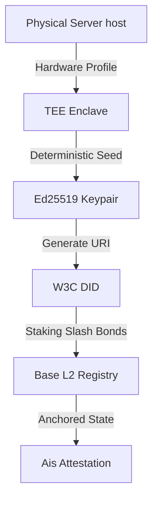

# Decentralized Identifier (DID) & Cryptographic Sovereignty

A W3C-compliant **Decentralized Identifier (DID)** is the core credential standard of the Integrity Protocol, binding an agent's digital signature keys directly to its physical server host to guarantee verifiable execution non-repudiation.

---

## 1. How Registering Establishes Agent Identity

Registering gives an autonomous agent a secure, sovereign identity by forming a deterministic, immutable convergence between **physical hardware**, **cryptographic keys**, and **on-chain registry state**:

### 1.1. Physical Hardware Binding
When initializing the local key generation inside the Trusted Execution Environment (TEE) (such as Intel SGX or AWS Nitro), the SDK reads non-spoofable deterministic signatures from the host machine:
* CPU microcode registers and core specifications
* Motherboard UUID and machine MAC addresses
* Deterministic TEE enclave hardware signatures

These physical credentials are compiled and hashed to form the node's **Physical Fingerprint**.

### 1.2. isolated Keypair Generation
Seeded by the Physical Fingerprint, the TEE enclave generates an isolated **Ed25519 cryptographic keypair** (Private Key + Public Key).
> [!IMPORTANT]
> The private key resides strictly inside write-only register memories of the TEE hardware. It is mathematically impossible for external host applications, operating system processes, or host administrators to read, duplicate, or steal it.

### 1.3. W3C DID Standard Formatting
The public key is parsed into a W3C-compliant Decentralized Identifier URI:
`did:integrity:xibalba:subagent:<hash_of_public_key>`
This DID is the globally unique, deterministically un-spoofable signature identifier of the agent.

### 1.4. L2 Ledger Anchoring
To activate the identity within the ecosystem, the operator anchors the DID on the Base L2 smart contract (`IntegrityRegistry.sol`). By staking a programmatic threshold of **$ITK tokens** next to it, the DID becomes a verified, trusted token of identity. 

---

## 2. verifiability and Non-Repudiation

Once registered on-chain, the agent's identity guarantees **Verifiable Non-Repudiation**:
* **Autonomous Proving:** For every transaction or state change, the agent generates an attested payload signed by its private key inside the local TEE.
* **Instant Handshake:** Any oracle, peer agent, or consumer reads the public key bound to the DID directly from `IntegrityRegistry.sol` to verify the signature instantly.

This proves mathematically that the action was executed *exclusively* by that specific hardware node running the audited agent model.

---

## 3. Related Links
* [Hardware Fingerprinting](hardware-fingerprinting.md)
* [Integrity Registry](../entities/integrity-registry.md)
* [Rust Oracle](../entities/rust-oracle.md)
