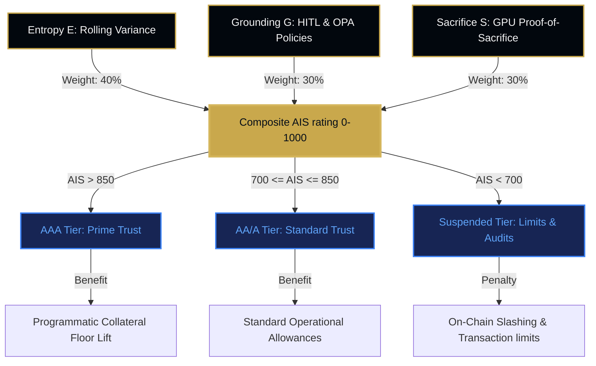

# The Tri-Metric Protocol

The **The Tri-Metric Protocol** (also packaged as the **Attestation Vector**) is our proprietary mathematical evaluation framework. It compiles high-dimensional agent telemetry into a multi-dimensional trust coordinate, representing how safely, predictably, and accountably an agent is operating.

## 1. The Tri-Metric Equations

The protocol measures and combines three key vectors:

### A. Entropy (E) - Stability Metric
Measures the rolling mathematical variance in response logs, token metadata, and transaction outputs. High volatility or unpredictable behavioral drifts decay this score exponentially:
$$E = e^{-1.5 \times \text{variance}} \times 1000$$
Where $\text{variance}$ represents the verified behavioral telemetry drift.

### B. Grounding (G) - Compliance Metric
Measures the density of verified human-in-the-loop (HITL) approvals and static policy compliance events. Direct, unverified autonomous mutations decay this score, while verified administrative consensus locks it at 950+.

### C. Sacrifice (S) - Economic Metric
Quantifies the economic "skin in the game" or physical computational overhead committed by the agent host. This prevents cheap Sybil identity replication:
$$S = \min\left(1.0, \frac{\text{GPU\_Hours}}{\text{Threshold}}\right) \times 1000$$

---

## 2. Agent Integrity Score (AIS)
The **Agent Integrity Score (AIS)** is the composite trust rating (0 to 1000) calculated as a weighted average of our Tri-Metric vector:
$$\text{AIS} = (E \times 0.4) + (G \times 0.3) + (S \times 0.3)$$

The resulting score defines the agent's creditworthiness and assigns it to a strict alphabetical reputation tier on the registry (e.g., `AAA`, `AA`, `A`):

*   **AAA Tier (AIS > 850):** Eligible for reduced **Staking Floors** and priority execution corridors.
*   **AA/A Tier (AIS 700 - 850):** Standard operational limits.
*   **Default/Suspended Tier (AIS < 700):** Subject to transaction limits and potential **Slashing Weights** audits.

## 3. Related Terms
-   **BCC:** Telemetry from the [Behavioral Commitment Chain](behavioral-commitment-chain.md) serves as the direct data source for Tri-Metric calculations.
-   **ZKP:** The calculation of the AIS vector can be compiled into [Aztec Noir Circuits](aztec-noir-circuits.md) to protect operator privacy.
-   **Paymaster:** The [Stablecoin Vault Paymaster](../entities/stablecoin-vault-paymaster.md) is responsible for converting collected transaction-level fees into deflationary buybacks, serving as a tokenomic sink linked to the overall AIS average.
