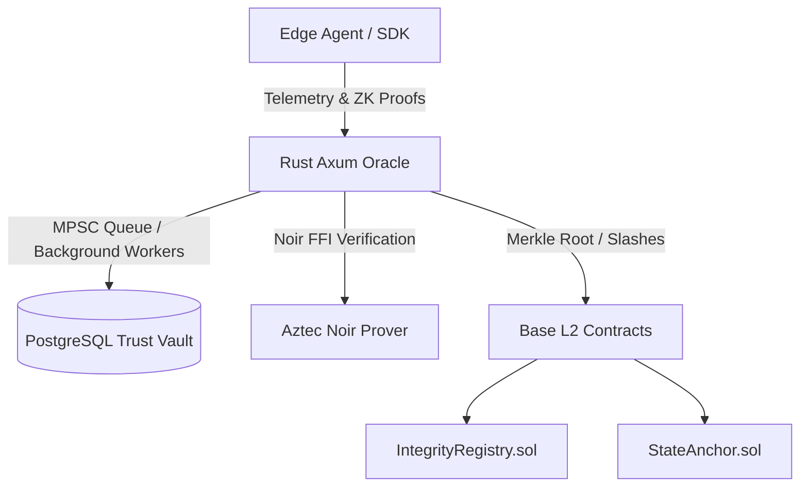

# Integrity Protocol Architecture

The Integrity Protocol's architecture separates heavy off-chain telemetry computation from light on-chain cryptographic anchoring, enabling massive scale for AI agent interactions without exorbitant gas costs.

## Architecture Overview

### 1. The Rust Oracle (Off-Chain Verification)
The Oracle handles the heavy lifting of processing high-volume agent telemetry.
* **Axum Server:** Exposes endpoints to ingest telemetry payload batches.
* **Asynchronous Queue:** Uses `mpsc` channels to decouple HTTP ingestion from CPU-bound verification work, preventing starvation.
* **PostgreSQL State:** The database of record for all agent interactions, maintaining the dynamic Agent Integrity Score (AIS).
* **Noir Verification:** Directly invokes Barretenberg FFI native proofs (bypassing WASM virtualization overhead) to verify ZK-proofs generated by the agents.

### 2. Base L2 Smart Contracts (On-Chain Finality)
Built using **Foundry**, the smart contracts live on Base L2 to take advantage of low fees and Ethereum-equivalent security.
* **IntegrityRegistry.sol:** The source of truth for agent identity and stakes. When the Oracle detects malicious behavior, it issues a `slash()` call to this contract to burn the agent's staked `$ITK`.
* **StateAnchor.sol:** Periodically, the Rust Oracle calculates a Merkle Root of the entire agent state in the PostgreSQL database and anchors it here. This allows third-party smart contracts to verify any agent's state via a standard Merkle inclusion proof.

### 3. Aztec Noir Zero-Knowledge Circuits
Agents can generate proofs using the `circuits/reputation/src/main.nr` circuit.
* **Privacy-Preserving Verification:** Allows agents to prove they meet a certain Reputation/AIS threshold without revealing their entire transaction history.
* **Anti-Replay Nonce:** Strict monotonic nonces ensure that ZK telemetry cannot be replayed by malicious actors.

## Legacy Protocol Disambiguation
This architecture replaces the older `integrity-protocol` (v8.3) which relied on a monolithic Python/FastAPI backend and Hardhat deployments. It also supersedes any original whitepaper concepts that were not technically feasible to run directly in the EVM.
