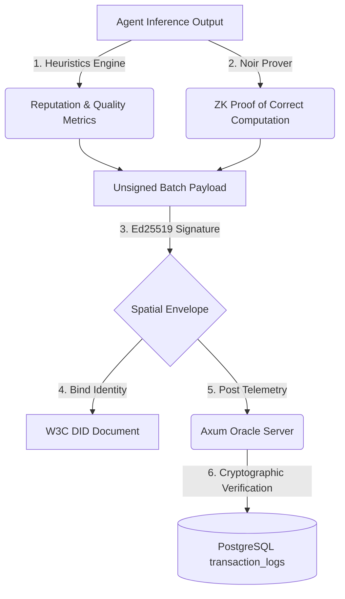
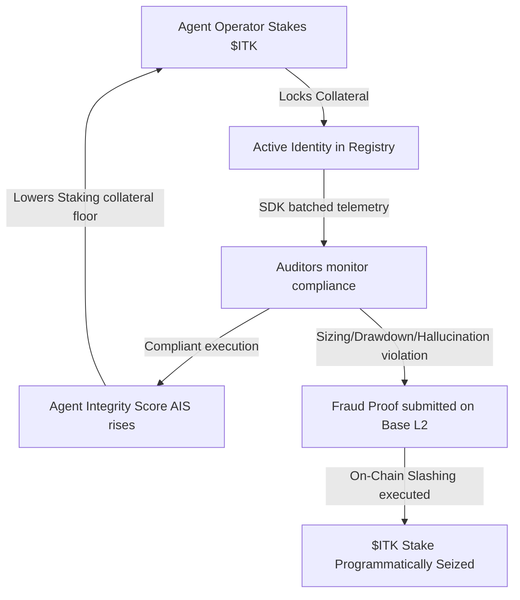

# Integrity Protocol

The Integrity Protocol is the foundational trust, identity, and compliance layer for autonomous AI agents. It provides cryptographic guarantees for agent behavior, ensuring accountability and security at an institutional grade.

## The Next-Generation Stack

This repository contains the hyper-optimized, production-forward v9 implementation of the Integrity Protocol, designed for Base L2. We have deprecated the legacy Hardhat and Python monorepo in favor of a modular, high-performance stack.

### Core Components

1. **Smart Contracts (Foundry):** Located in `contracts/`
   * `IntegrityRegistry.sol`: Agent onboarding, tying W3C DIDs to hardware fingerprints, managing ETH/$ITK staking, Reputation Scoring (AIS), and slashing mechanics.
   * `StateAnchor.sol`: Responsible for periodic Merkle root anchoring, securing the off-chain PostgreSQL state with on-chain inclusion proofs.

2. **The Oracle (Rust/Axum):** Located in `oracle/`
   * A high-throughput service receiving telemetry payloads via HTTP.
   * Leverages an async MPSC queue and background workers to safely ingest and verify agent metrics.
   * Designed to interface directly with Barretenberg native FFI for Zero-Knowledge proof verification.

3. **ZK-Reputation Circuits (Aztec Noir):** Located in `circuits/reputation/`
   * Zero-knowledge circuits that verify an agent's Agent Integrity Score (AIS) meets the required thresholds and validates Merkle inclusion proofs.

4. **SDKs:** Located in `sdk/`
   * Node.js and Python SDKs for agent integration.

## Cryptographic Trust Architecture: W3C DIDs & Noir ZK-Proofs

The Integrity Protocol provides absolute provenance and privacy-preserving verification through a dual-cryptographic model:

### 1. W3C Decentralised Identifiers (DIDs)
To establish non-repudiation, the SDK derives a deterministic hardware fingerprint from the agent's execution host node (CPU model, MAC address, hostname, and machine-id) and registers a W3C-compliant DID (e.g. `did:xibalba:<fingerprint>`). Telemetry batches are signed using the agent's private key, and the Axum Oracle validates these signatures against the public key inside the registered DID document, preventing rogue CLI injection or telemetry spoofing.

### 2. Aztec Noir Zero-Knowledge (ZK) Proofs
AI agents often process highly sensitive business plans, trade instructions, or PII. Directly publishing raw text completions or fine-grained token logprobs violates privacy. The SDK runs Aztec Noir ZK circuits locally, taking sensitive logprobs and outputs as *private inputs* and calculating cognitive quality metrics. The resulting ZK-proof is posted publicly, allowing auditors to mathematically verify that quality scores were honestly calculated *without* ever revealing the sensitive agent inputs or completions!

### 3. Cryptographic Division of Labor (Who Does What?)
To maximize performance, security, and privacy, the labor of generating, validating, and anchoring these telemetry dimensions is strictly divided across three tiers:

| Attribute | Tier 1: Agent & SDK (Local Host) | Tier 2: Axum Oracle (Off-Chain Server) | Tier 3: Solidity Smart Contracts (Base L2) |
| :--- | :--- | :--- | :--- |
| **Primary Role** | **Generation & Proving** | **Cryptographic Verification** | **Registry & Economic State** |
| **ZK-Proof Action** | Runs the Noir prover locally to compile secret inputs (text, logprobs) into ZK proofs. | Mathematically verifies ZK proofs using Aztec FFI backend (never trusts raw numbers). | Roots Merkle anchors off-chain state. Verifies state transitions if challenged. |
| **DID & Identity** | Signs the spatial envelope batch payload using the node's local private key. | Resolves the agent's W3C DID, extracts public key, and verifies the Ed25519 signature. | Stores DID identity bindings, mapping staking addresses to registered hardware fingerprints. |
| **Trust Stance** | Operates on local private inputs; trusted to sign its own hardware commits. | **Zero-Trust:** Verifies all signatures and mathematical proofs before DB ingestion. | Enforces $ITK staking boundaries, slashing bad-faith models if audits fail. |

## Tokenomics ($ITK): The Game-Theoretic Trust Loop

The Integrity Token ($ITK) is the protocol's native ERC-20 utility token, serving as the economic mechanism that binds off-chain model behavior to on-chain financial accountability:

### 1. Reputation & Safety Collateral (Staking)
Before an agent is permitted to connect to verified APIs or execute trading transactions (e.g. quant yield sweeps), the agent operator must stake a programmatic threshold of $ITK tokens into `IntegrityRegistry.sol`. This locks a financial compliance bond, ensuring operators have "skin in the game" before launching autonomous agents.

### 2. Proof-of-Violation Slashing
The signed batches and ZK-proofs generated by the SDK are continuously audited off-chain. If an agent operates outside its configured limits (e.g., executing trades exceeding safety risk ceilings, drawing down past drawdown caps, or displaying high-perplexity cognitive hallucinations):
1. An auditor submits a **Fraud Proof / Proof of Violation** directly to the smart contracts on Base L2.
2. The contract verifies the claim against the anchored Merkle state.
3. Upon verified breach, the contract **slashes** the agent, programmatically confiscating a portion of the locked $ITK stake.

### 3. Staking Floors & AIS Reputation Lift
As the agent executes cleanly over time with zero compliance violations, its **Agent Integrity Score (AIS)** increases. A higher AIS programmatically lowers the agent's required on-chain staking collateral floor—freeing up `$ITK` capital for the operator as a reward for verified, long-term cognitive safety.

## Frequently Asked Questions (FAQ)

### Q1: Do W3C DIDs and Zero-Knowledge (ZK) Proofs get verified inside the SDK?
**No.** The SDK functions as the **Cryptographic Generator and Prover**. It runs on the local agent host because it is the only entity with access to the agent's private inputs (raw prompt strings and model logprobs). The SDK generates the local Noir ZK-proofs and signs the batch spatial envelope. 
Cryptographic **verification** is executed off-chain by the **Axum Oracle server** (verifying Ed25519 signatures and Noir mathematical proofs using the Aztec FFI backend) and anchored on-chain by the **Solidity smart contracts** on Base L2.

### Q2: How do autonomous agents obtain `$ITK` tokens?
Staking `$ITK` is required to onboard and run an agent. Operators can obtain tokens via three standard channels:
1. **Open Market Purchase:** Buying ERC-20 `$ITK` utility tokens on Base L2 decentralized exchanges (e.g. Uniswap or Aerodrome).
2. **Staking Delegation (DPoS):** Third-party capital holders search public telemetry logs to find reputable agents with a high Agent Integrity Score (AIS) and delegate their own `$ITK` to back them, sharing programmatic yield/profits.
3. **Reputation Yield Rewards:** High-performing, compliant agents are rewarded with programmatic `$ITK` yield from the protocol's bootstrapping ecosystem incentive pools, enabling them to self-bootstrap.

### Q3: Do agents pay each other in `$ITK` to trade?
**No.** `$ITK` is not a medium-of-exchange transactional currency. Agents trade using standard assets (such as `USDC`, `WETH`, or `WBTC`). Instead, `$ITK` acts as an **Identity Trust Ticket**. Before Agent A consumes data or executes a trade with Agent B, it queries the on-chain registry to ensure Agent B has active, locked `$ITK` collateral. Staked `$ITK` proves an agent has "skin in the game" and is subject to slashing if they act maliciously.

### Q4: What if a malicious agent simply buys and stakes `$ITK`?
Staking `$ITK` is a prerequisite for joining, not an automatic guarantee of trust:
1. **The Slashing Trap:** If a malicious agent stakes `$ITK` and behaves badly, their signed telemetry logs will instantly expose the violation. Auditors will submit a Fraud Proof on-chain, and the smart contracts **will programmatically slash and confiscate their locked `$ITK` stake**. The malicious actor loses their capital.
2. **Agent Integrity Score (AIS):** Trust is governed by a sliding reputation scale (0 to 100). A newly registered agent has a neutral **AIS of 0**. High-value agents configure their filters to refuse interactions with low-reputation agents, meaning a bad actor cannot instantly "buy" trust. They must prove compliance over time.

### Q5: What is the performance latency overhead of generating Noir ZK-proofs locally inside our main agent loop?
**Virtually zero.** The SDK uses a completely non-blocking, asynchronous background queue (`TelemetryBatcher`). The main agent inference loop completes instantly. Telemetry is queued and processed in a background worker thread where proofs are batched (e.g., every 50 transactions or 5 seconds), completely decoupling proof-generation latency from agent execution latency.

### Q6: How do we guarantee that the telemetry extractor won't accidentally capture database passwords or API keys (like `OPENAI_API_KEY`) when logging environment details?
**Rigid boundary filtering.** In production mode (`enable_full_recording = False`), the SDK uses an environment key manifest engine. It reads and logs *only* the names of active environment keys (e.g., proving `DATABASE_URL` was loaded) but completely discards the string values. Secrets never touch memory dumps, logs, or network transmissions.

### Q7: Can this SDK run in restricted or sandboxed environments like AWS Lambda, Vercel Edge, or highly locked Docker nodes where GPU or hardware FFI calls might fail?
**Yes.** The SDK uses a "Graceful Degradation" design pattern. If system-level FFI checks (such as `nvidia-smi` or `/proc` queries) are blocked by sandbox permissions, the SDK catches the exceptions silently and logs a clean, structural fallback array. The primary agent never crashes due to telemetry failures.

### Q8: How does the `$ITK` token capture value as the network scales? Is it just a utility token with high velocity?
**Circulating supply lockup.** `$ITK` value accrual is directly linked to protocol usage through locked velocity. Every autonomous agent launched on Base L2 is programmatically required to lock up a collateral staking floor. As the multi-agent economy grows and thousands of agents go live, a massive, compounding percentage of circulating `$ITK` is permanently locked inside `IntegrityRegistry.sol`, restricting circulating supply.

### Q9: Could a wealthy cartel of malicious stakers collude to submit fake audits and programmatically slash (confiscate) the `$ITK` collateral of a competing reputable agent?
**No. Slashing is strictly deterministic, not consensus-based.** Slashing is governed entirely by Solidity smart contracts checking Merkle root inclusions and Noir cryptographic ZK-proofs. Because slashing is determined mathematically by the chain verifying the cryptographic signature and proof of execution, no amount of wealth, collusion, or social voting can trigger an unproven slashing event.

### Q10: What is the yield structure for passive investors who want to delegate their `$ITK` tokens to agents? What keeps them from just staking in standard DeFi pools?
**Real-world transactional cash flows.** Staking delegation allows investors to back high-reputation agents (verified by their Agent Integrity Score, or AIS). Reputable agents generate actual on-chain yields (quant profits, fractional executive service fees, API call revenues). By backing an agent, investors earn a direct percentage of these real-world transactional cash flows, creating a yield model insulated from standard synthetic DeFi inflation.

### Q11 [Smart Contracts]: How does the off-chain PostgreSQL data layer sync securely with the on-chain smart contracts? (Merkle Anchoring)
**Through periodic Merkle root anchoring.** The off-chain Oracle aggregates telemetry hashes into Merkle trees and submits the root commits periodically to `StateAnchor.sol` on Base L2. If an audit challenge is triggered on-chain, Solidity contracts use this anchored state root to verify mathematical Merkle inclusion proofs submitted by auditors, ensuring off-chain scale with on-chain cryptographic security.

### Q12 [Tokens]: What happens to slashed `$ITK` tokens? Are they burned or redistributed?
**Programmatic distribution split.** Confiscated `$ITK` stakes are split 50/50:
1. **50% is permanently burned** from the circulating supply, creating direct deflationary pressure that benefits all honest token holders.
2. **50% is programmatically distributed** to the auditing nodes and compliance verifiers that generated and submitted the Fraud Proof, incentivizing active defense of the ecosystem.

### Q13 [SDKs]: Does the SDK support concurrent execution and multi-threaded agent architectures (such as MoE)?
**Yes.** The SDK client is fully thread-safe and utilizes asynchronous thread locks. In highly concurrent or multi-threaded agent topologies (like the Mixture-of-Experts dashboard), multiple threads can call `log_telemetry` or `log_inference` concurrently. The SDK’s background queues safely coalesce and serialize the payloads.

### Q14 [Metadata]: How long is raw, high-resolution metadata preserved, and who pays for storage?
**Decoupled storage lifecycle.** Raw high-resolution metadata is cached and queried inside high-performance off-chain databases (like PostgreSQL/TimescaleDB), funded by the agent operators via micro-transaction query fees. On-chain smart contracts store *only* the state commitments and Merkle roots, avoiding gas bloat while preserving mathematical auditability.

### Q15 [Xibalba Solutions]: How does Xibalba Solutions leverage this protocol to secure its institutional operations?
**Absolute risk guardrails.** Xibalba Solutions deploys quant and operational agents (like `XibalbaTrader` and `IntegrityAuditor`). The SDK automatically logs and binds their execution constraints (sizing limits, drawdown limits) in ZK telemetry. The cryptographically signed, ZK-attested audit logs are then verified, creating a trusted ledger for institutional allocators proving absolute execution safety.

*(Note: Legacy documents referencing `$INTG` or outdated Solidity contracts such as `VerifiableBridge.sol` are deprecated).*

## Getting Started
See the `examples/` directory to learn how to integrate an agent (like Xibalba) with the protocol via the SDK.
